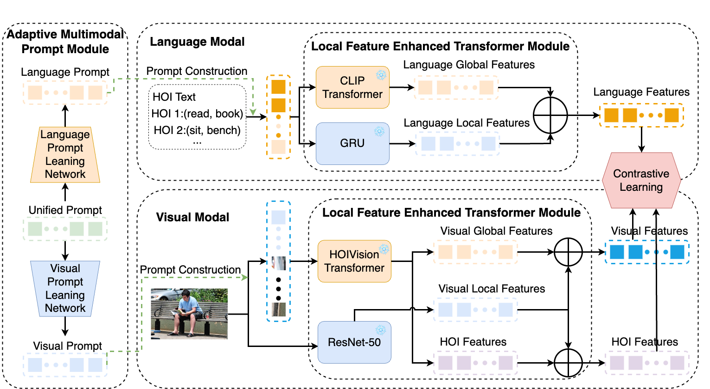

# Transferable Human-object Interaction Detector (THID)

## Overview

THID is an end-to-end transformer-based human-object interaction (HOI) detector. [[Paper]](https://cse.buffalo.edu/~jsyuan/papers/2022/CVPR2022_4126.pdf)



- **Motivation**: It is difficult to construct a data collection including all possible combinations of human actions and interacting objects due to the combinatorial nature of human-object interactions (HOI). In this work, we aim to develop a transferable HOI detector for the wide range of unseen interactions.
- **Components**: (1) We treat independent HOI labels as the natural language supervision of interactions and embed them into a joint visual-and-text space to capture their correlations. (2) Our visual encoder is instantiated as a Vision Transformer with new learnable HOI tokens and a sequence parser to generate HOI predictions with bounding boxes. (3) It distills and leverages the transferable knowledge from the pretrained CLIP model to perform the zero-shot interaction detection.

## Preparation

### Installation

Our code is built upon [CLIP](https://github.com/openai/CLIP). This repo requires to install [PyTorch](https://pytorch.org/get-started/locally/) and torchvision, as well as small additional dependencies.

```bash
conda install pytorch torchvision cudatoolkit=11.3 -c pytorch
pip install ftfy regex tqdm numpy Pillow matplotlib
```

### Dataset

The experiments are mainly conducted on **HICO-DET** and **SWIG-HOI** dataset. We follow [this repo](https://github.com/YueLiao/PPDM) to prepare the HICO-DET dataset. And we follow [this repo](https://github.com/scwangdyd/large_vocabulary_hoi_detection) to prepare the SWIG-HOI dataset.

#### HICO-DET

HICO-DET dataset can be downloaded [here](https://drive.google.com/open?id=1QZcJmGVlF9f4h-XLWe9Gkmnmj2z1gSnk). After finishing downloading, unpack the tarball (`hico_20160224_det.tar.gz`) to the `data` directory. We use the annotation files provided by the [PPDM](https://github.com/YueLiao/PPDM) authors. We re-organize the annotation files with additional meta info, e.g., image width and height. The annotation files can be downloaded from [here](https://drive.google.com/open?id=1lqmevkw8fjDuTqsOOgzg07Kf6lXhK2rg). The downloaded files have to be placed as follows. Otherwise, please replace the default path to your custom locations in [datasets/hico.py](./datasets/hico.py).

``` plain
 |─ data
 │   └─ hico_20160224_det
 |       |- images
 |       |   |─ test2015
 |       |   |─ train2015
 |       |─ annotations
 |       |   |─ trainval_hico_ann.json
 |       |   |─ test_hico_ann.json
 :       :
```

## Training

Run this command to train the model in HICO-DET dataset

``` bash
python -m torch.distributed.launch --nproc_per_node=2 --use_env main.py \
    --batch_size 8 \
    --output_dir [path to save checkpoint] \
    --epochs 100 \
    --lr 1e-4 --min-lr 1e-7 \
    --hoi_token_length 50 \
    --enable_dec \
    --dataset_file hico
```

## Inference

Run this command to evaluate the model on HICO-DET dataset

``` bash
python main.py --eval \
    --batch_size 1 \
    --output_dir [path to save results] \
    --hoi_token_length 50 \
    --enable_dec \
    --pretrained [path to the pretrained model] \
    --eval_size 256 [or 224 448 ...] \
    --test_score_thresh 1e-4 \
    --dataset_file hico
```

## Models

|   Model   | dataset | HOI Tokens | AP seen | AP unseen | Log | Checkpoint |
|:---------:| :-----: | :-----: |:-------:|:---------:| :-----: | :-----: |
| `AMP-HOI` | HICO-DET | 10 |    -    |     -     | [Log](https://github.com/scwangdyd/promting_hoi/releases/download/v0.2/thid_hico_token10_epoch100_log.txt) | [params](https://github.com/scwangdyd/promting_hoi/releases/download/v0.2/thid_hico_token10_epoch100.pth)|

## Citing

Please consider citing our paper if it helps your research.

```
None
```